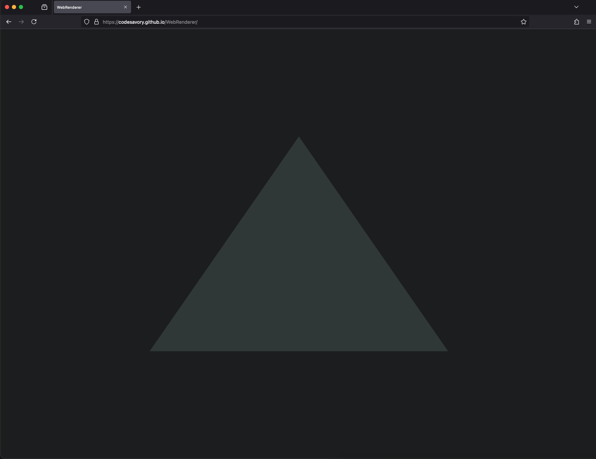

# WebRenderer
Building a real-time renderer for the web using OpenGL and C++. Using HelloImGui to make it cross platform across: windows, linux, mac and web. Using WebAssembly and Emscripten to port to WebGL and Js.

## Progress

  

